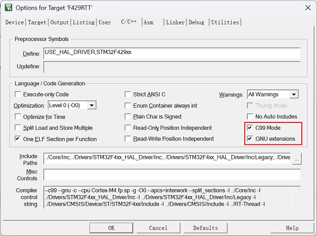

# KFIFO 环形缓冲区库

KFIFO 是一个通用的环形 FIFO（First In, First Out）缓冲区实现，适用于嵌入式系统、实时系统以及其他需要高效数据缓冲的场景。该库基于 Linux 内核的 `kfifo` 实现，经过简化和修改以适配单片机和其他嵌入式环境。

---

## 功能特点

- **支持静态和动态分配的 FIFO 缓冲区**：可以根据需求选择固定大小或动态分配内存的方式。
- **支持多种数据类型**：包括基本数据类型（如 `int`、`float`）和自定义结构体类型。
- **支持基于记录的 FIFO**：可以存储变长数据，适用于复杂数据结构。
- **线程安全**：提供自旋锁（`spinlock`）支持，用于多线程环境下的同步。
- **高效内存使用**：FIFO 的大小必须为 2 的幂，充分利用内存。
- **多种操作接口**：包括数据写入、读取、跳过、查看等。

---

## 文件结构

- **`kfifo.h`**：KFIFO 的头文件，定义了所有接口和宏。
- **`kfifo.c`**：KFIFO 的实现文件，包含所有核心逻辑。
- **`example_kfifo.c`**：示例代码，展示了 KFIFO 的各种使用场景。

---

## 环形缓冲区的设计限制

1. FIFO 的大小必须为 2 的幂。
2. 不适用于内存非常有限的系统，因为动态分配需要额外的内存。
3. 在多线程环境中，需使用自旋锁保护 FIFO 操作。

---

## 使用场景

- 嵌入式系统中的数据缓冲，例如传感器数据采集。
- 多线程或多任务环境中的数据通信。
- 实时数据流处理，例如音视频数据缓冲。
- 需要高效存储和读取变长数据的场景。

---

## 宏定义说明

以下是 `kfifo.h` 中定义的主要宏及其功能说明：

### 设置宏

- **`__must_check`**
  表示必须检查函数返回值，否则会在编译阶段报警告，默认必须检查，如果不想检查，可以启用注释掉的空宏。

- **`__CHECKER__`**
  未定义该宏时会检查 `ARRAY_SIZE` 中的元素是否为数组，默认定义了该宏，既不检查。keil 环境下如果使用的是编译器 V5 版本，则必须定义该宏，V6 则没有限制，V6 建议注释掉该宏的定义，即启用检查。

- **`DEFINE_LOCK(lock)`**
  定义一个自旋锁，用于多线程环境下的同步。
  - `lock`：自旋锁的名称。

### FIFO 定义和初始化

- **`DECLARE_KFIFO(fifo, type, size)`**
  定义一个静态分配的 FIFO。
  - `fifo`：FIFO 名称。
  - `type`：FIFO 中存储的数据类型。
  - `size`：FIFO 的大小，必须为 2 的幂。

- **`DECLARE_KFIFO_PTR(fifo, type)`**
  定义一个动态分配的 FIFO 指针。
  - `fifo`：FIFO 名称。
  - `type`：FIFO 中存储的数据类型。

- **`INIT_KFIFO(fifo)`**
  初始化一个通过 `DECLARE_KFIFO` 定义的 FIFO。

- **`DEFINE_KFIFO(fifo, type, size)`**
  定义并初始化一个静态分配的 FIFO。
  - `fifo`：FIFO 名称。
  - `type`：FIFO 中存储的数据类型。
  - `size`：FIFO 的大小，必须为 2 的幂。

---

### FIFO 操作

- **`kfifo_in(fifo, buf, n)`**
  将数据写入 FIFO。
  - `fifo`：目标 FIFO。
  - `buf`：要写入的数据缓冲区。
  - `n`：要写入的数据元素数量。

- **`kfifo_out(fifo, buf, n)`**
  从 FIFO 中读取数据。
  - `fifo`：目标 FIFO。
  - `buf`：存储读取数据的缓冲区。
  - `n`：要读取的数据元素数量。

- **`kfifo_put(fifo, val)`**
  向 FIFO 中写入单个数据。
  - `fifo`：目标 FIFO。
  - `val`：要写入的数据。

- **`kfifo_get(fifo, val)`**
  从 FIFO 中读取单个数据。
  - `fifo`：目标 FIFO。
  - `val`：存储读取数据的变量。

- **`kfifo_out_peek(fifo, buf, n)`**
  查看 FIFO 中的数据，但不移除。
  - `fifo`：目标 FIFO。
  - `buf`：存储查看数据的缓冲区。
  - `n`：要查看的数据元素数量。

- **`kfifo_skip(fifo)`**
  跳过 FIFO 中的一个数据。

- **`kfifo_skip_count(fifo, count)`**
  跳过 FIFO 中的多个数据。
  - `fifo`：目标 FIFO。
  - `count`：要跳过的数据数量。

---

### FIFO 状态检查

- **`kfifo_is_empty(fifo)`**
  检查 FIFO 是否为空。

- **`kfifo_is_full(fifo)`**
  检查 FIFO 是否已满。

- **`kfifo_len(fifo)`**
  获取 FIFO 中已使用的元素数量。

- **`kfifo_avail(fifo)`**
  获取 FIFO 中剩余可用空间的元素数量。

---

### FIFO 清空和释放

- **`kfifo_reset(fifo)`**
  清空 FIFO 中的所有数据。

- **`kfifo_reset_out(fifo)`**
  跳过 FIFO 中的所有数据，但保留写入位置。

- **`kfifo_free(fifo)`**
  释放动态分配的 FIFO。

---

### 记录模式相关宏

- **`STRUCT_KFIFO_REC_1(size)`**
  定义一个记录模式的 FIFO，记录头大小为 1 字节。
  - `size`：FIFO 的大小。

- **`STRUCT_KFIFO_REC_2(size)`**
  定义一个记录模式的 FIFO，记录头大小为 2 字节。
  - `size`：FIFO 的大小。

- **`kfifo_peek_len(fifo)`**
  获取 FIFO 中下一条记录的长度。

---

## 接口示例

### FIFO 初始化

1. **静态分配 FIFO**

   ```c
   DECLARE_KFIFO(my_fifo, int, 8);  // 定义一个 FIFO，存储 8 个 int 类型数据
   INIT_KFIFO(my_fifo);             // 初始化 FIFO
   ```

2. **动态分配 FIFO**

   ```c
   DECLARE_KFIFO_PTR(my_fifo, int); // 定义一个动态分配的 FIFO
   kfifo_alloc(&my_fifo, 8);        // 分配 FIFO，大小为 8 个 int
   ```

3. **基于外部缓冲区初始化 FIFO**

   ```c
   DECLARE_KFIFO_PTR(my_fifo, int);
   void *buffer = malloc(8 * sizeof(int));          // 分配外部缓冲区
   kfifo_init(&my_fifo, buffer, 8 * sizeof(int));   // 使用外部缓冲区初始化 FIFO
   ```

---

### 数据操作

1. **写入数据**

   ```c
   int data[] = {1, 2, 3, 4};
   unsigned int len = kfifo_in(&my_fifo, data, 4); // 写入 4 个数据
   ```

2. **读取数据**

   ```c
   int output[4];
   unsigned int len = kfifo_out(&my_fifo, output, 4); // 读取 4 个数据
   ```

3. **跳过数据**

   ```c
   kfifo_skip_count(&my_fifo, 2); // 跳过 2 个数据
   ```

4. **查看数据（不移除）**

   ```c
   int peek_data[4];
   unsigned int len = kfifo_out_peek(&my_fifo, peek_data, 4); // 查看 4 个数据
   ```

5. **检查 FIFO 状态**

   ```c
   if (kfifo_is_empty(&my_fifo)) {
       printf("FIFO 已空\n");
   }
   if (kfifo_is_full(&my_fifo)) {
       printf("FIFO 已满\n");
   }
   ```

6. **清空 FIFO**

   ```c
   kfifo_reset(&my_fifo); // 清空 FIFO
   ```

7. **释放 FIFO**

   ```c
   kfifo_free(&my_fifo); // 释放动态分配的 FIFO
   ```

---

## 示例代码

以下是一些常见的使用示例：

### 示例 1：静态分配 FIFO

```c
void example_static_fifo(void) {
    DECLARE_KFIFO(my_fifo, int, 8);
    INIT_KFIFO(my_fifo);

    int input_data[] = {1, 2, 3, 4};
    kfifo_in(&my_fifo, input_data, 4);

    int output_data[4];
    kfifo_out(&my_fifo, output_data, 4);

    for (int i = 0; i < 4; i++) {
        printf("Output: %d\n", output_data[i]);
    }
}
```

### 示例 2：动态分配 FIFO

```c
void example_dynamic_fifo(void) {
    DECLARE_KFIFO_PTR(my_fifo, int);
    if (kfifo_alloc(&my_fifo, 8)) {
        printf("FIFO 分配失败\n");
        return;
    }

    int input_data[] = {10, 20, 30, 40};
    kfifo_in(&my_fifo, input_data, 4);

    int output_data[4];
    kfifo_out(&my_fifo, output_data, 4);

    for (int i = 0; i < 4; i++) {
        printf("Output: %d\n", output_data[i]);
    }

    kfifo_free(&my_fifo);
}
```

### 示例 3：基于记录的 FIFO

```c
void example_record_fifo(void) {
    STRUCT_KFIFO_REC_1(64) my_fifo;
    INIT_KFIFO(my_fifo);

    int input_data[] = {1, 2, 3};
    kfifo_in(&my_fifo, input_data, sizeof(input_data));

    char buffer[64];
    unsigned int record_len = kfifo_peek_len(&my_fifo);
    kfifo_out(&my_fifo, buffer, record_len);

    for (unsigned int i = 0; i < record_len / sizeof(int); i++) {
        printf("Record: %d\n", ((int *)buffer)[i]);
    }
}
```

---

## 注意事项

1. **FIFO 大小必须为 2 的幂**：如果指定的大小不是 2 的幂，库会自动向上取最近的 2 的幂。
2. **线程安全**：在多线程环境中，需使用自旋锁保护 FIFO 操作。
3. **动态分配的 FIFO 需手动释放**：使用 `kfifo_free` 释放动态分配的 FIFO。

---

## 运行示例

运行 [`example_kfifo.c`](example_kfifo.c ) 文件中的主函数可以查看所有示例的运行效果：

```sh
gcc example_kfifo.c kfifo.c -o example_kfifo
./example_kfifo
```

---

## 常见问题

### keil 下的基本设置

由于该 KFIFO 使用了大量的 `GNU` 扩展，在 `keil` 下编译时需要开启 `GNU` 扩展。

- **编译器 V5 设置**
使用 `C99 Mode`，启用 `GNU extensions`。

- **编译器 V6 设置**
使用 `gnu99`或者 `gnu11`。


---

## 更新记录

- **v2.0.0**（2025-04-26）：新的版本，在原始 `KFIFO` 库基础上进行修改，详细功能请参考 `README.md` 以及原始 `KFIFO` 相关文档。
- **v1.0.0**（2024-07-23）：初始版本发布。

---

## 贡献者

- **作者**: Jia Zhenyu
- **日期**: 2025-04-26
- **版本**: 2.0.0

---

## 许可证

请遵循原始作者的许可协议。
