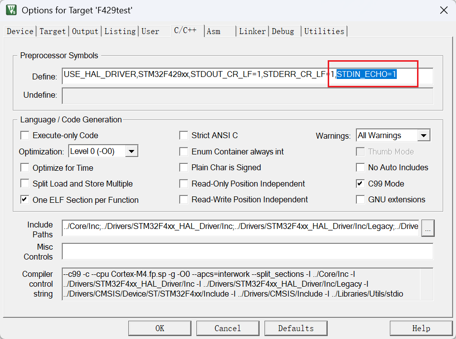
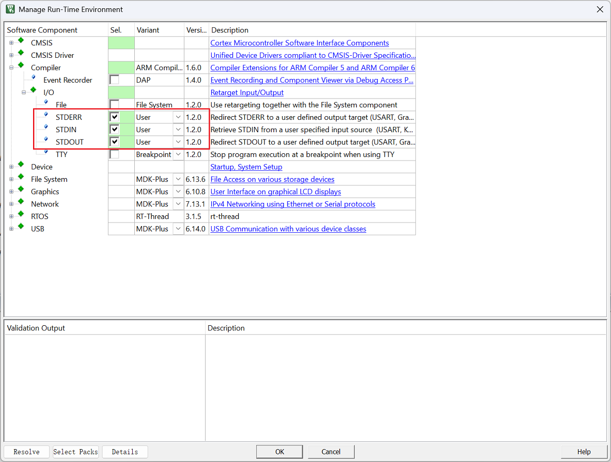

# stdio_redirect

将标准输入输出（`printf` / `scanf` / `fprintf(stderr, ...)` 等）重定向到 `UART` 。

## 📁 文件结构

```bash
stdio_redirect.c      // 重定向实现源文件
README.md             // 本说明文档
```

## 🛠 使用方式

### 1. UART 配置

在 `stdio_redirect.c` 顶部设置 UART 对象：

```c
#define STDIO_UART huart1   // 标准输入/输出所用的 UART
#define STDERR_UART huart1  // 错误输出所用的 UART，可同步或不同
```

### 2. 启用输入回显（可选）

默认不启用，需要在项目编译配置中定义宏 `STDIN_ECHO=1` 来启用输入内容回显：


启用时每个字符实时发送；禁用时按行或缓冲区满时批量发送。

### 3. Keil MDK 配置

在项目选项中配置标准 I/O 的链接：

- **STDOUT**：选择 `User`
- **STDIN**：选择 `User`
- **STDERR**：选择 `User`

这样才能正确链接到本文件中的 `stdout_putchar()`、`stdin_getchar()`、`stderr_putchar()` 函数。


### 4. UART 初始化要求

确保在调用 `printf()` 等函数前，UART 已在 `usart.c` 中初始化完毕。使用阻塞模式收发（`HAL_UART_Transmit` 和 `HAL_UART_Receive`）。

## 🧪 示例

### 基础用法

```c
#include <stdio.h>

char str[100];
printf("请输入一行字符串：");
scanf("%s", str);
printf("你输入的是：%s\n", str);
```

### 错误输出示例

```c
fprintf(stderr, "错误信息：文件打开失败\n");
```

### 组合输出

```c
printf("普通信息\n");
fprintf(stderr, "警告信息\n");
```

## ⚠️ 注意事项

- **初始化顺序**：确保 UART 完全初始化后再调用 `printf()` 等函数。
- **缓冲策略**：启用 `STDIN_ECHO` 时逐字符发送，性能稍低但实时性好；禁用时批量发送，性能好但有延迟。
- **堵塞模式**：使用 `HAL_MAX_DELAY` 作为超时参数，可能导致程序堵塞，确保 UART 工作正常。
- **输入缓冲**：`stdin_getchar()` 一次只读取一个字符，`scanf()` 会调用多次。

## 👨‍💻 作者

- **作者**: Jia Zhenyu
- **日期**: 2024-07-05
- **版本**: 1.0.1

## 更新记录

- **v1.0.0**（2024-07-03）：初始版本发布。
- **v1.0.1**（2024-07-05）：取消了 GCC 和 USB 支持，优化了重定义函数。

## 许可证

该项目为开源项目，用户可以自由使用、修改和分发。
